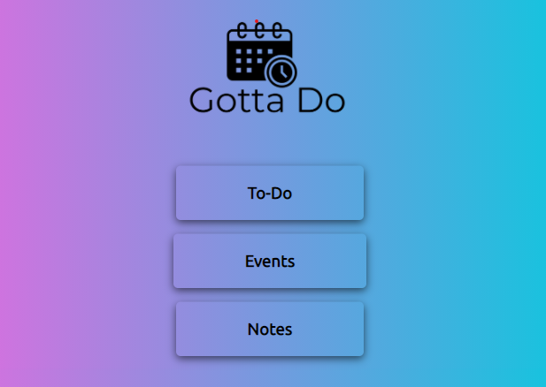
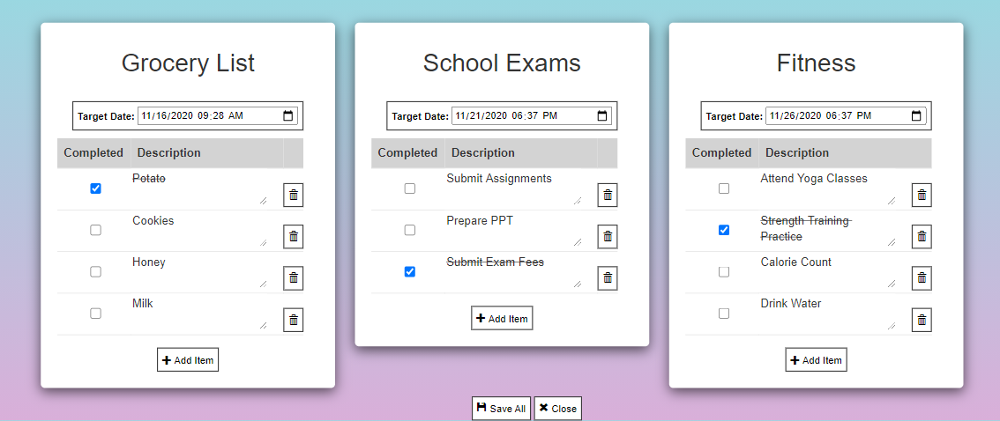
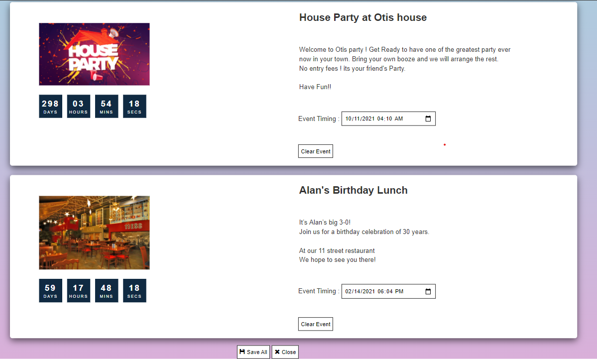
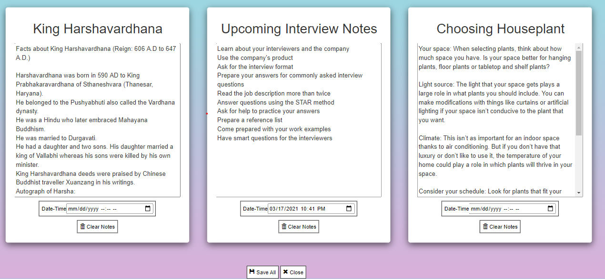

# Gotta Do
* ### This is fully functional webapp to allow users create and organize Todolists, Events, Notes.
## Live Demo - xyz.com

# Technologies used - 
## FrontEnd - 
* ### HTML
* ### CSS
* ### JavaScript
* ### Bootstrap
## Backend -
* ### AJAX
* ### JsonBin API for JSON Storage.

# Sample Images
* ### Home Page
* 

* ### To Do List
* 

* ### Events
* 

* ### Notes
* 

